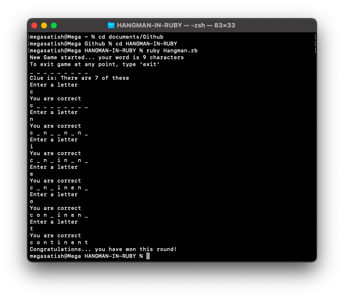

<div align="center">

  <a name="readme-top"></a>
  # <a href="https://amey-thakur.github.io/RUBY/"></a> <br> Hangman in Ruby

  [](LICENSE)
  
  [](https://amey-thakur.github.io/RUBY/)
  [](https://github.com/Amey-Thakur/HANGMAN-IN-RUBY)

  A high-fidelity, modular terminal-based Hangman game engineered in Ruby, demonstrating strict adherence to Object-Oriented Programming (OOP) principles and Human-Machine Interaction (HMI) design within a console environment.

  **[Source Code](Source%20Code/)** &nbsp;·&nbsp; **[Technical Specification](docs/SPECIFICATION.md)** &nbsp;·&nbsp; **[Live Demo](https://amey-thakur.github.io/HANGMAN-IN-RUBY/)**

</div>

---

<div align="center">

  [Authors](#authors) &nbsp;·&nbsp; [Overview](#overview) &nbsp;·&nbsp; [Features](#features) &nbsp;·&nbsp; [Structure](#project-structure) &nbsp;·&nbsp; [Results](#results) &nbsp;·&nbsp; [Quick Start](#quick-start) &nbsp;·&nbsp; [Usage Guidelines](#usage-guidelines) &nbsp;·&nbsp; [License](#license) &nbsp;·&nbsp; [About](#about-this-repository) &nbsp;·&nbsp; [Acknowledgments](#acknowledgments)

</div>

---

<!-- AUTHORS -->
<div align="center">

  <a name="authors"></a>
  ## Authors

| <a href="https://github.com/Amey-Thakur"></a><br>[**Amey Thakur**](https://github.com/Amey-Thakur)<br><br>[](https://orcid.org/0000-0001-5644-1575) | <a href="https://github.com/msatmod"></a><br>[**Mega Satish**](https://github.com/msatmod)<br><br>[](https://orcid.org/0000-0002-1844-9557) |
| :---: | :---: |

</div>

> [!IMPORTANT]
> ### 🤝🏻 Special Acknowledgement
> *Special thanks to **[Mega Satish](https://github.com/msatmod)** for her meaningful contributions, guidance, and support that helped shape this work.*

---

<!-- OVERVIEW -->
<a name="overview"></a>
## Overview

**Hangman in Ruby** is a robust interactive system engineered to demonstrate the elegance and efficiency of Ruby's object-oriented architecture. By bridging the gap between foundational algorithms and tactile terminal-based gaming, this repository provides a comprehensive study into systematic software engineering and logical state orchestration.

The application serves as a digital exploration of game theory and responsive console interaction, structured into modular components that ensure maintainability and high-performance execution directly within the shell environment.
<br><br>
This project was developed as a distinctive milestone during the **[30-Day Ruby Challenge](https://amey-thakur.github.io/RUBY/)**, a collaborative engineering sprint undertaken by **Amey Thakur** and **Mega Satish**. It represents the practical synthesis of concepts explored in the comprehensive **[Ruby Repository](https://github.com/Amey-Thakur/RUBY)**, demonstrating the transition from theoretical study to production-grade implementation.

### Engineering Heuristics
The interaction model is governed by strict **computational design patterns** ensuring fidelity and responsiveness:
*   **Modular Orchestration**: The system utilizes a specialized class hierarchy (Board, Game, Display) for complex logic separation, providing a tactile confirmation for every user action.
*   **State Integrity**: Beyond simple arrays, the system integrates a validation engine that dynamically verifies every move, reinforcing the deterministic narrative of the gameplay.
*   **Tactile Feedback**: Real-time terminal rendering ensures the mission docket remains synchronized, maintaining a zero-latency bridge between raw user input and visual board updates.

> [!TIP]
> **Logic-Driven Interaction**
>
> To maximize user engagement, the system employs a **multi-stage validation system**. **Visual board vectors** visualize the current state, and **deterministic win-check algorithms** provide immediate feedback, strictly coupling player goals with state changes. This ensures the user's mental model is constantly synchronized with the underlying game trajectory.

---

<!-- FEATURES -->
<a name="features"></a>
## Features

| Feature | Description |
|---------|-------------|
| **Tactile Interaction** | Implements **Real-Time Terminal Feedback** for intuitive and high-impact move placement. |
| **Modular OOP** | Custom **Class-Based Architecture** ensuring clean separation of data and logic. |
| **Logic Verification** | Robust **State-Based Validation** ensuring mission data survives invalid input events. |
| **Cinematic Playback** | A deterministic **Game Setup Sequence** that ensures assets are synchronized before interaction. |
| **Dynamic Turn-Taking** | Integrated **Game Orchestration Engine** for visual and structural turn classification. |
| **Victory Detection** | **High-Fidelity Algorithmic Scanners** that celebrate mission completion milestones. |
| **Zero-Latency Web Runtime** | Deployed via **WebAssembly (WASM)** with **Fiber-based non-blocking I/O** for a native console feel in the browser. |
| **Structural Clarity** | In-depth and detailed comments integrated throughout the codebase for transparent logic study. |

> [!NOTE]
> ### Interactive Polish: The Console Corridor
> We have engineered a **Logic-Driven Display Manager** that calibrates layout consistency across multiple vectors to simulate professional CLI environments. The visual language focuses on the minimalist "Console Corridor" aesthetic, ensuring maximum focus on the interactive strategy trajectory.

### Tech Stack
- **Language**: Ruby 3.x
- **Runtime (Web)**: **WebAssembly (WASM)** via `@ruby/3.3-wasm-wasi`
- **Concurrency**: **Ruby Fibers** (Coroutines) for non-blocking browser I/O
- **Terminal Engine**: **xterm.js** with `addon-fit` for responsive rendering
- **Logic**: **Object-Oriented Orchestration** (Modular Classes)
- **Testing**: **RSpec** (Behavior-Driven Development)
- **Code Quality**: **RuboCop** (Static Code Analysis)
- **Tooling**: Built for Terminal Environments

---

<!-- STRUCTURE -->
<a name="project-structure"></a>
## Project Structure

```python
HANGMAN-IN-RUBY/
│
├── docs/                            # Project Documentation
│   ├── Ruby Logo.png                # Branding Asset
│   └── SPECIFICATION.md             # Technical Architecture
│
├── Mega/                            # Attribution Assets
│   ├── Filly.jpg                    # Companion (Filly)
│   ├── Mega.png                     # Profile Image (Mega Satish)
│   └── ...                          # Additional Media
│
├── Source Code/                     # Primary Application Layer
│   └── Hangman/                     # Game Root
│       ├── lib/                     # Core Logic
│       │   ├── board.rb             # State Engine
│       │   ├── display.rb           # UI Module
│       │   └── game.rb              # Game Loop
│       ├── main.rb                  # Entry Point
│       └── spec/                    # Verification Layer
│           ├── board_spec.rb        # Unit Tests
│           └── game_spec.rb         # System Tests
│
├── web/                             # Web Deployment Layer
│   └── index.html                   # WASM Runtime Entry Point
│
├── .github/                         # Intelligence Layer
│   └── workflows/                   # Automated Protocols
│       └── deploy.yml               # CD Pipeline
│
├── Gemfile                          # Dependency Definitions
├── Gemfile.lock                     # Dependency Lockfile
├── SECURITY.md                      # Security Protocols
├── CITATION.cff                     # Project Citation Manifest
├── codemeta.json                    # Metadata Standard
├── LICENSE                          # MIT License
├── Hangman.rb                       # Legacy Entry Point (Preserved)
└── README.md                        # Project Entrance
```

---

<a name="results"></a>
## Results

<div align="center">
  <b>Output</b>
  <br>
  <i>Interactive Hangman Session: Guessing "CONTINENT".</i>
  <br>
  
</div>

---

<!-- QUICK START -->
<a name="quick-start"></a>
## Quick Start

### 1. Prerequisites
- **Ruby 3.0+**: Required for runtime execution. [Download Ruby](https://www.ruby-lang.org/)
- **Bundler**: For managing gem dependencies. (`gem install bundler`)
- **Git**: For version control and cloning. [Download Git](https://git-scm.com/downloads)

> [!WARNING]
> **Runtime Environment Isolation**
>
> The application is designed for terminal-based HMI. Ensure your terminal supports **ANSI escape codes** if you wish to see the full fidelity of color-coded error warnings and board states.

### 2. Installation & Setup

#### Step 1: Clone the Repository
Open your terminal and clone the repository:
```bash
git clone https://github.com/Amey-Thakur/HANGMAN-IN-RUBY.git
cd HANGMAN-IN-RUBY
```

#### Step 2: Install Dependencies
Install the required gems (RSpec, RuboCop, Reek) defined in the `Gemfile`:
```bash
bundle install
```

### 3. Execution

#### Play the Game
Launch the primary game loop:
```bash
ruby "Source Code/Hangman/main.rb"
```

#### Run Tests
Verify the system integrity using RSpec:
```bash
bundle exec rspec "Source Code/Hangman/spec"
```

> [!TIP]
> **Instant Play**
>
> You can play the game instantly in your browser without any installation via our WebAssembly deployment:
>
> 👉🏻 **[Play Hangman Live](https://amey-thakur.github.io/HANGMAN-IN-RUBY/)**

---

<!-- USAGE GUIDELINES -->
<a name="usage-guidelines"></a>
## Usage Guidelines

This repository is openly shared to support learning and knowledge exchange across the engineering community.

**For Students**  
Use this project as reference material for understanding **Ruby Object-Oriented Design**, **Terminal Input/Output Handling**, and **Modular Logic Separation**. The source code is available for study to facilitate self-paced learning and exploration of **classic algorithms and HMI design principles**.

**For Educators**  
This project may serve as a practical lab example or supplementary teaching resource for **Procedural Programming**, **Object-Oriented Design**, and **Logic Gates in Games** courses. Attribution is appreciated when utilizing content.

**For Researchers**  
The documentation and architectural approach may provide insights into **systematic project structuring**, **Ruby-based logic verification**, and **sensory feedback loops in CLI-based software**.

---

<!-- LICENSE -->
<a name="license"></a>
## License

This repository and all its creative and technical assets are made available under the **MIT License**. See the [LICENSE](LICENSE) file for complete terms.

> [!NOTE]
> **Summary**: You are free to share and adapt this content for any purpose, even commercially, as long as you provide appropriate attribution to the original authors.

Copyright © 2022 Amey Thakur & Mega Satish

---

<!-- ABOUT -->
<a name="about-this-repository"></a>
## About This Repository

**Created & Maintained by**: [Amey Thakur](https://github.com/Amey-Thakur) & [Mega Satish](https://github.com/msatmod)

This project features **Hangman in Ruby**, a logic-driven interactive gaming system. It represents a personal exploration into **Ruby**-based class orchestration and high-performance console design. It was developed as a key project within the **[30-Day Ruby Challenge](https://amey-thakur.github.io/RUBY/)**, marking a significant step in mastery of the language.

**Connect:** [GitHub](https://github.com/Amey-Thakur) &nbsp;·&nbsp; [LinkedIn](https://www.linkedin.com/in/amey-thakur) &nbsp;·&nbsp; [ORCID](https://orcid.org/0000-0001-5644-1575)

### Acknowledgments

Grateful acknowledgment to [**Mega Satish**](https://github.com/msatmod) for her exceptional collaboration and partnership during the development of this Hangman Ruby project. Her constant support, technical clarity, and dedication to software quality were instrumental in achieving the system's functional objectives. Learning alongside her was a transformative experience; her thoughtful approach to problem-solving and steady encouragement turned complex requirements into meaningful learning moments. This work reflects the growth and insights gained from our side-by-side journey. Thank you, Mega, for everything you shared and taught along the way.

Special thanks to the **mentors and peers** whose encouragement, discussions, and support contributed meaningfully to this learning experience.

---

<div align="center">

  [↑ Back to Top](#readme-top)

  [Authors](#authors) &nbsp;·&nbsp; [Overview](#overview) &nbsp;·&nbsp; [Features](#features) &nbsp;·&nbsp; [Structure](#project-structure) &nbsp;·&nbsp; [Results](#results) &nbsp;·&nbsp; [Quick Start](#quick-start) &nbsp;·&nbsp; [Usage Guidelines](#usage-guidelines) &nbsp;·&nbsp; [License](#license) &nbsp;·&nbsp; [About](#about-this-repository) &nbsp;·&nbsp; [Acknowledgments](#acknowledgments)

  <br>

  <a href="https://amey-thakur.github.io/RUBY/"></a> **[Hangman Ruby Game](https://amey-thakur.github.io/HANGMAN-IN-RUBY/)**

  ---

  ### 🎓 [Computer Engineering Repository](https://github.com/Amey-Thakur/COMPUTER-ENGINEERING)

  **Computer Engineering (B.E.) - University of Mumbai**

  *Semester-wise curriculum, laboratories, projects, and academic notes.*

</div>
