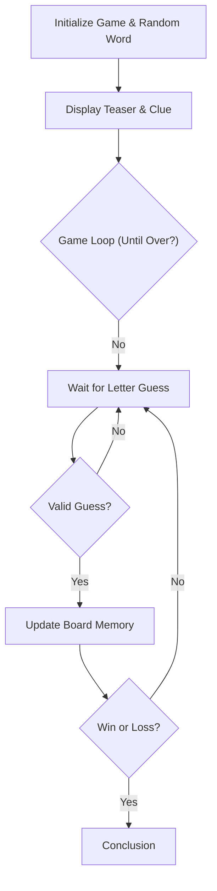

# Technical Specification: Hangman in Ruby

## Architectural Overview

**Hangman in Ruby** is a structured console application designed to demonstrate clean object-oriented programming (OOP) principles within the Ruby ecosystem. The project serves as a practical implementation of fundamental software engineering concepts, including state management, modular design, and robust user input handling in a terminal environment.

### Game Logic Flow

---

## Technical Implementations

### 1. Core Ruby Engine
-   **Runtime Environment**: Optimized for **Ruby 3.x**, utilizing the standard library for robust computational and game logic.
-   **Modular Design**: Implements an organized source code architecture where logic is encapsulated within the `Hangman` class, managing word selection, life tracking, and state resolution.

### 2. Specialized Logic & Components
-   **Word Management**: Features a curated list of words and clues, utilizing randomized selection to ensure unique replay experiences.
-   **State Tracking**: Maintains real-time tracking of player lives, word teasers, and guess history.
-   **Interaction Interface**: A centralized controller for terminal-based prompts and feedback, ensuring a responsive CLI experience.

### 3. Engineering Quality
-   **Software Design Patterns**: Focuses on encapsulation and single responsibility, ensuring the game state is protected and modified through formal methods.
-   **Logical Verification**: Implements pattern matching and iterative checks to verify player guesses against the target word.

---

## Technical Prerequisites

-   **Runtime**: Ruby 3.0 or higher ([Ruby-lang.org](https://www.ruby-lang.org/)).
-   **Verification**: Manual execution or integrated unit testing.
-   **Development**: Professional IDE or text editor supporting Ruby integration.

---

*Technical Specification | Hangman Ruby Project | Version 1.0*
