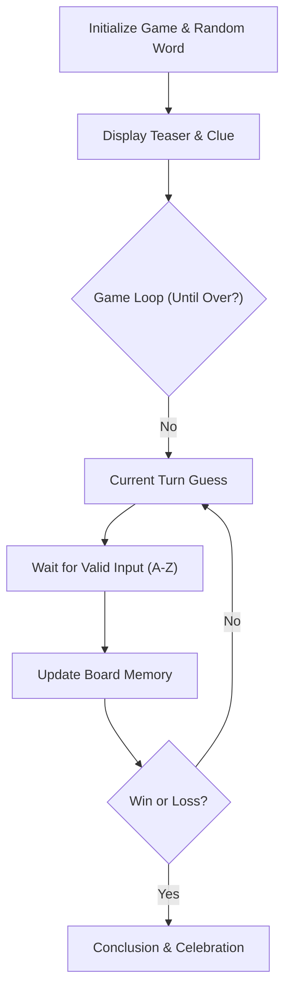

# Technical Specification: Hangman in Ruby

## Architectural Overview

**Hangman in Ruby** is a structured, modular console application designed to demonstrate clean object-oriented programming (OOP) principles within the Ruby ecosystem. The project serves as a practical implementation of fundamental software engineering concepts, including state management, modular design, and robust user input handling in a terminal environment.

### Game Logic Flow

---

## Technical Implementations

### 1. Core Ruby Engine
-   **Runtime Environment**: Optimized for **Ruby 3.x**, utilizing the standard library for robust computational and game logic.
-   **Modular Design**: Implements a highly organized source code architecture where logic is separated into specialized classes for display, board state, and game orchestration.

### 2. Specialized Modules & Components
-   **Board Management**: Handles the hidden word state and teaser representation, utilizing array-based transformations to update discovered characters.
-   **Game Orchestration**: Manages the main interactive loop, life tracking (7 lives), word selection, and terminal state resolution.
-   **Display Interface**: A dedicated module for terminal-based UI rendering, providing color-coded feedback and a polished "Console Corridor" aesthetic.

### 3. Engineering Quality
-   **Software Design Patterns**: Implements core OOP principles including encapsulation, module-based composition, and single responsibility for scalable software architecture.
-   **State-Based Validation**: Features robust input sanitization and verification logic to ensure reliable terminal interaction and state integrity.

---

## Technical Prerequisites

-   **Runtime**: Ruby 3.0 or higher ([Ruby-lang.org](https://www.ruby-lang.org/)).
-   **Testing Framework**: RSpec for behavior-driven development and logic verification.
-   **Development**: Professional IDE or text editor supporting Ruby (e.g., RubyMine, VS Code).
-   **Linting**: RuboCop and Reek for adherence to the Ruby Style Guide and code quality standards.

---

*Technical Specification | Hangman Ruby Project | Version 1.0*
